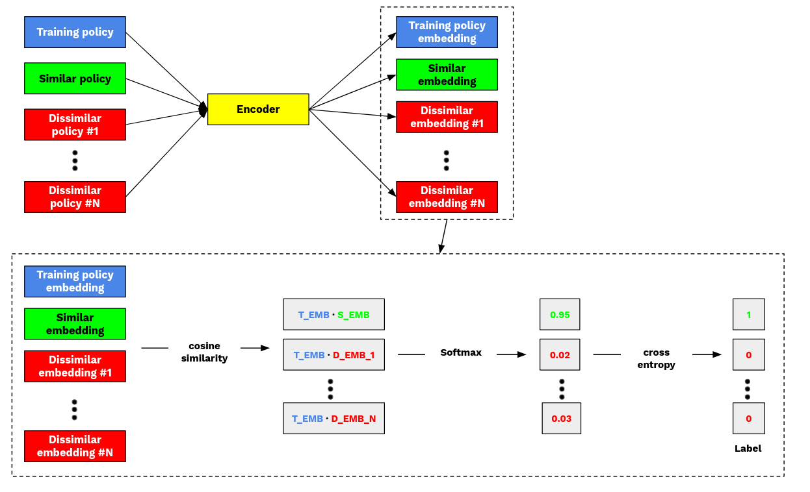

# 🧠 Contrastive Learning for Insurance Policy Profitability Prediction

This project explores the use of **contrastive learning** as an alternative to traditional supervised classification methods (e.g. XGBoost) for predicting the **profitability of insurance policies**.

---

## 📘 Project Overview

In traditional classification tasks, each observation is independently assigned a label. 

Here, we propose a **contrastive learning approach** that transforms each insurance policy into a dense embedding and leverages the relative similarity of policies to predict profitability.

We compare this method against a **classic XGBoost model** trained on the same dataset.

---

## 📊 Dataset

- Each row in the dataset corresponds to an **insurance policy**, represented by engineered numeric features.
- The target variable is **binary**:
  - `0` = Unprofitable policy
  - `1` = Profitable policy

---

## 🧪 Problem Setup

Instead of training a classifier directly, we aim to **learn a meaningful embedding space** such that:
- Policies with **similar profitability** lie **close together**
- Policies with **different profitability** lie **far apart**

At inference time, a test policy is embedded and labeled by the **closest labeled embedding** (nearest neighbor) in the training set.

---

## 🔁 Contrastive Learning Approach

### 💡 Core Idea:
The model is trained by comparing **a query policy** against a set of **candidate policies**, including:
- 1 policy with the **same label**
- `n` policies with the **opposite label**

### 🧱 Architecture

- **Encoder**: A feed-forward neural network maps each policy to a dense embedding.
- **Similarity Measure**: Cosine similarity between query and candidate embeddings.
- **Loss**: Contrastive loss implemented as:
  1. Compute cosine similarities between query and all candidates.
  2. Apply softmax to similarities.
  3. Use cross-entropy where the label is the index of the candidate with the **same** profitability as the query.

---

## 🧪 Baseline: XGBoost

As a benchmark, we train a **standard XGBoost classifier** on the same features and target.

### Comparison Metrics:
- Accuracy
- AUC-ROC (optional)
- Precision / Recall
- Embedding space interpretability (qualitative)

---

## 📈 Evaluation 

| Metric          | **XGBoost** | **Contrastive Learning** |
|-----------------|-------------|--------------------------|
| **Accuracy**    |             |                          |
| **Precision**   |             |                          |
| **Recall**      |             |                          |

---

## 📁 Project Structure

